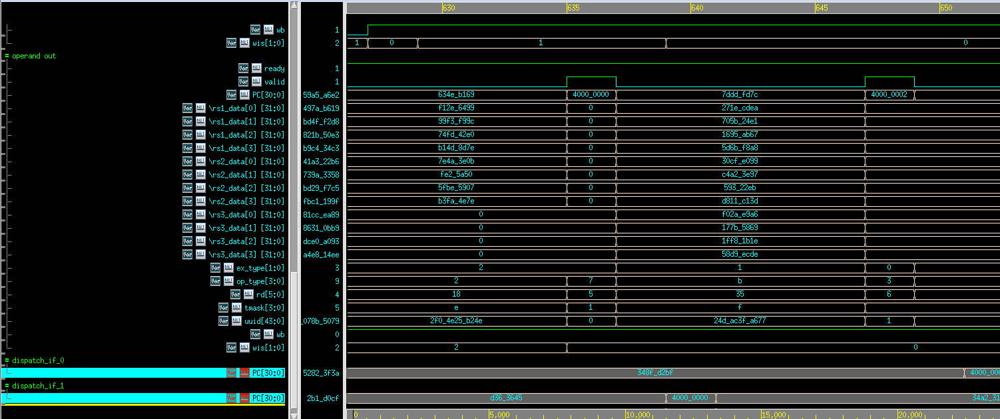

## External Architecture Spec

This document is for engineers or students to use vortex as a IP externally, and those people want to know the architecture but not too deep. If you belongs to the upper catagories, you can read this document.

Vortex is divided into two parts, core and memory subsystems. The core, VX_core_top does not include icache or dcache. Memory subsystems consist of configurable L1 and L2 cache.

### Vortex Core


Vortex core is composed of fetch, dispatch, instr, execute and commit, schedule. 

#### Fetch

Fetching unit is to consume the payload from the info from icache and scheduler, and produce to dispatch unit. The icache provides the instruction as data, some other infos are the tag. The tag includes the uuid and wid. Scheduler provides the PC, tmask. PC and tmask are the control related info. 

if L1_ENABLE is turned on, additional pending module is inserted, pending module is both ibuffer fills and LSU stalls. In this case, ibuffer would wait until execution unit execute the next instruction, but execution unit cannot execute because the ibuffer is full, the LSU inside of it needs to wait for the ibuffer before the LSU take action. 


As the following, fetch is the initiator, send a request before time 625 with tag of 4, at time 630, icache respond a payload with tag of 4. In time 635, fetch send another request with tag of 8 after 635, at 640-645, icache respond a payload with tag of 8.


Scheduler provide the corresponding PC, tmask, uuid and wid infos before the instruction generated. 


To the output to decode side, within the same time, the fetch_if payload is sent to the decode unit.

 


Some other fetch unit includes the trace and ram. trace is to get the log of instructions, ram is to buffer the instructions.

#### Decode 

Decode stage is to decode the instruction, fetch unit is its producer, issue unit and scheduler is its consumer.

First is the decode to issue through decode_if, the decode info is transfered to issue stage within the same cycle. Those info includes execution type(ALU, FPU, SFU), operation type, rd, rs1, rs2, rs3, and tmask

 

Another part is decode will send a message to scheduler the warp id and is_wtall to indicate whether it is a wstall instruction.

 

#### Issue

The issue stage in a vortex is responsible for dispatching decoded instructions to the execution units. Issue stage's producer is the info from writeback stage, decoded info from decode stage. Issue stage's consumer is the execution stage. 

if PERF_ENABLE is enabled, a performance counter module in hardware is generated. It will monitor the performance in the following, ibuffer stalls, scoreboard stalls, operation stalls. 

Inside of the issue stage is the issue_slices, each slices has issue buffer, scoreboard, operands and dispatch. Each issue slice is independent of other issue slides, totally ISSUE_WIDTH of issue slides. Each issue slides get PER_ISSUE_WARPS of instructions.

Within the issue slice, issue buffer as a buffer stage, sending the required info to scoreboard directly. Scoreboard will do the following logic:

```
always @(*) begin
    for (integer i = 0; i < NUM_OPDS; ++i) begin
        operands_busy_n[i] = operands_busy[i];
        if (ibuffer_fire) begin
            operands_busy_n[i] = inuse_regs[ibuf_opds[i]];
        end
        if (writeback_fire) begin
            if (ibuffer_fire) begin
                if (writeback_if.data.rd == ibuf_opds[i]) begin
                    operands_busy_n[i] = 0;
                end
            end else begin
                if (writeback_if.data.rd == stg_opds[i]) begin
                    operands_busy_n[i] = 0;
                end
            end
        end
        if (staging_fire && staging_if[w].data.wb && staging_if[w].data.rd == ibuf_opds[i]) begin
            operands_busy_n[i] = 1;
        end
    end
end
```

Scoreboard in the upper logic, will do some checks, for example, if operands is busy, if rd is the same as writeback value(prevent WAW), if rd is equal to the rs in staging operations(WAR). Finally those legal instructions are sent to an arbitor. The scoreboard timing diagram is as below. Scoreboard provides the filtered info(rd, rs1, rs2, rs3, ex_type, op_type) to operands.

 

Operands stage is consisted of register files, the register value would be fetched in this stage. If there is a writeback address is the rs address, the writeback would happened first(solve RAW). The output waveform of operands is as follows, scoreboard_out is the input, and the operand_out is the output:

 

Dispatch stage is to dispatch the instructions to the execution units according to the thread mask and execution type. Total dispatch interface is NUM_EX_UNITS per issue slice. NUM_EX_UNITS is calculated based on how many ALU, SFU, FPU, LSU. Within each dispatch stage, there is a crossbar. In the timing diagram, dispatch_if_1 first dispatch 4000_0000, then dispatch_if_0 dispatch 4000_0002. 

 


#### Execute 

In execute, SFUs and FPUs are pure arithmetic type operations. ALUs are mixed of arithmetic operations and branch control operations. LSU are Load/Store type operations. They need to be discussed case by case(will discuss below). Issue unit dispatch the operands to the execution units, execution unit send data to dcache interface, execution unit send commit info to commit unit, also, execution unit send csr info to scheduler, scheduler send branch control and warp control to execution unit. 


SFU: SFU is the special funtion units, the function is controlled by csr_unit. 

 

FPU: FPU is the floating point unit, has multiple functions, floating add, sub, mul, div/sqrt. 

 

ALU: ALU is for integer arithmetic.

 

LSU: 


 


